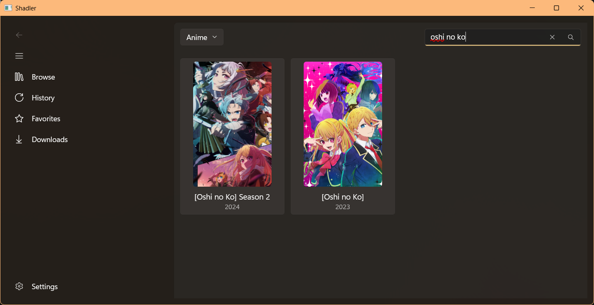
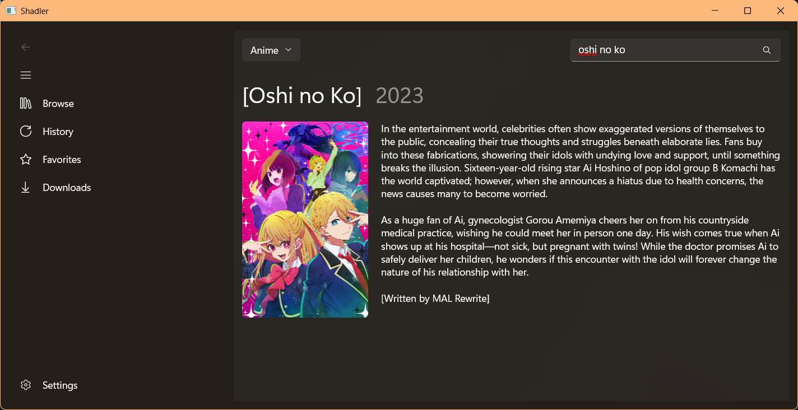

# Shadler WinUI 3
Yet another Windows app to watch anime, but on WinUI 3

## Why?
This port is meant to be the definitive version of [shadler](https://github.com/hithere-at/shadler). It has history support so you can pick where you left off quickly, it has favorites support so you can add your favorite content to it or so you dont forget to read/watch the content. Its also using WinUI 3 as the main user interface to make the app follow your Windows theme. This version is also how i imagined [shadler](https://github.com/hithere-at/shadler) to look like if it has a proper user interface. It is also my biggest project so far.

### Supported version
- Windows 10 17763 or above
- Windows 11

###  Screenshots (WIP)
#### Content browser

### NOTE
This is very early in development, so expect bugs and crashes. If you find any, please make an issue. I will still maintain the original version, but as of now, the original version will enter a maintenance only mode. Development will continue after the beta release of this version.